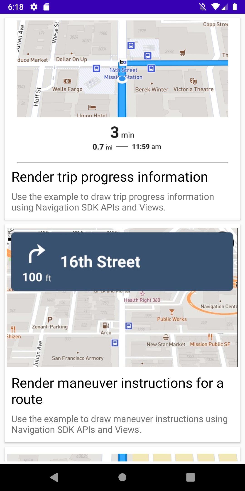

# Mapbox Navigation Android SDK Examples

The repository is a collection of examples showing off the [Mapbox Navigation Android SDK](https://github.com/mapbox/mapbox-navigation-android). In order to support minSdkVersion 21, Android Auto and preview features, there are three example apps.

1. [app](app) minSdkVersion of 21
2. [app-preview](app-preview) minSdkVersion of 21
2. [android-auto-app](android-auto-app) minSdkVersion of 23

<div align="center">
  
</div>

## Installation

Make sure you follow the steps under the [Installation](https://docs.mapbox.com/android/navigation/guides/installation/) guide. Once you have your **public and secret access tokens ready**, do the following:

### [app](app)

1. `git clone git@github.com:mapbox/mapbox-navigation-android-examples.git`
2. Go to `app/src/main/res/values`
3. Look for `mapbox_access_token.xml`
4. If the file already exists, swap `YOUR_ACCESS_TOKEN_HERE` with your public access token.
5. If the file doesn't exist then create one and add the following content to it
   ```
   <?xml version="1.0" encoding="utf-8"?>
   <resources xmlns:tools="http://schemas.android.com/tools">
       <string name="mapbox_access_token">YOUR_ACCESS_TOKEN_HERE</string>
   </resources>
   ```
6. Ensure that your secret token is added to [build.gradle](./build.gradle) or to global `gradle.properties` as described in the installation guide.
7. Run the examples under `app`.

## Previous versions

If you're looking for code examples from previous versions of the Navigation SDK, you can access them through the following links:
- [Navigation SDK v2](https://docs.mapbox.com/android/navigation/v2/guides/): https://github.com/mapbox/mapbox-navigation-android-examples/tree/main-v2
- [Navigation SDK v1](https://docs.mapbox.com/android/legacy/navigation/guides/): https://github.com/mapbox/mapbox-navigation-android/tree/v1.6.0/examples/

## Getting Help

- **Have a bug to report?** [Open an issue](https://github.com/mapbox/mapbox-navigation-android-examples/issues). If possible, include the version of Mapbox Navigation SDK, and an example that shows the issue.
- **Have an example request?** [Open an issue](https://github.com/mapbox/mapbox-navigation-android-examples/issues/). Tell us what the example should do and why you want it.

## Contributing

We welcome feedback and code contributions! Please see [CONTRIBUTING.md](CONTRIBUTING.md) for details.
