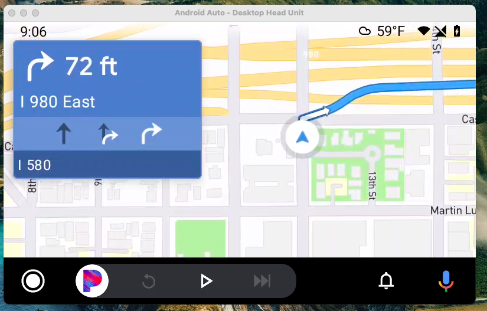

# Mapbox Navigation Android-Auto SDK Examples

The android-auto-app showcases the minimum integration needed to support the android-auto module in your application. The [android-auto](../android-auto/README.md) module is a portable example that can be copied into your app. See instructions for integrating below.

<div align="center" padding="100">
  
</div>

## Installation

1. Change "Configuration" of "android-auto-app". "Launch Options - Launch" should be "Nothing"
1. Update or create the "mapbox_access_token.xml" under "android-auto-app/src/main/res/values" and put below
   <?xml version="1.0" encoding="utf-8"?>
       <resources xmlns:tools="http://schemas.android.com/tools">
       <string name="mapbox_access_token" translatable="false" tools:ignore="UnusedResources">PUBLIC TOKEN HERE</string>
   </resources>
1. Establish Android Auto environment by following [Google's document](https://developer.android.com/training/cars/testing) or [Readme](https://github.com/mapbox/mapbox-navigation-android-examples/blob/main/android-auto/README.md)
1. Run "android-auto-app" which installs the app on your device
1. Run the app on "Desktop Head Unit"

## Enable route replay (AUTO_DRIVE)

When testing Android Auto, it is easy to simulate a route instead of using mock locations. Follow these instructions, to enable route replay.
https://docs.mapbox.com/android/navigation/guides/developer-tools/route-replay/

```
1. Start the desktop head unit
2. Open your navigation app
3. $ adb shell dumpsys activity service com.mapbox.navigation.examples.androidauto.car.MainCarAppService AUTO_DRIVE
```
