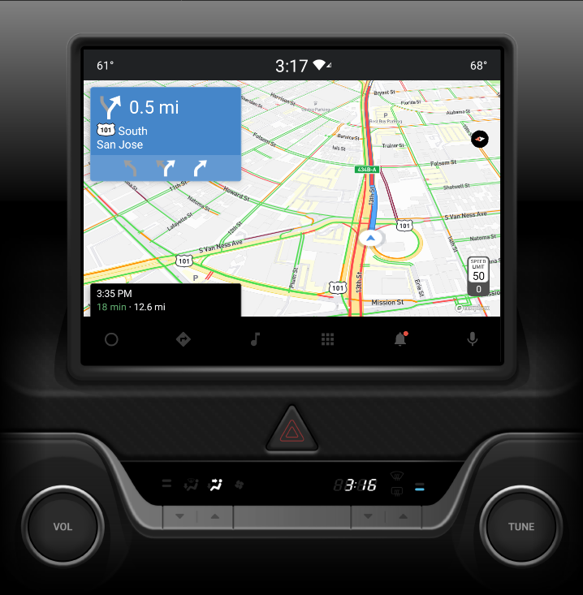

# Mapbox Navigation Android-Auto SDK Examples

The android-automotive-app showcases the minimum integration needed to support the android-automotive in your application.

<div align="center" padding="100">
  
</div>

## Installation

1. Change "Configuration" of "android-automotive-app". "Launch Options - Launch" should be "Nothing"
1. Update or create the "mapbox_access_token.xml" under "android-auto-app/src/main/res/values" and put below
   <?xml version="1.0" encoding="utf-8"?>
       <resources xmlns:tools="http://schemas.android.com/tools">
       <string name="mapbox_access_token" translatable="false" tools:ignore="UnusedResources">PUBLIC TOKEN HERE</string>
   </resources>
1. Establish Android Automotive developer environment by following [Google's document](https://developer.android.com/training/cars/testing#test-automotive-os)
1. Run "android-automotive-app" which installs the app onto the Automotive emulator

## Enable route replay (AUTO_DRIVE)

When testing Android Auto, it is easy to simulate a route instead of using mock locations. Follow these instructions, to enable route replay.
https://docs.mapbox.com/android/navigation/guides/developer-tools/route-replay/

```
2. Open your navigation app
3. $ adb shell dumpsys activity service com.mapbox.navigation.examples.aaos.car.MainCarAppService AUTO_DRIVE
```
